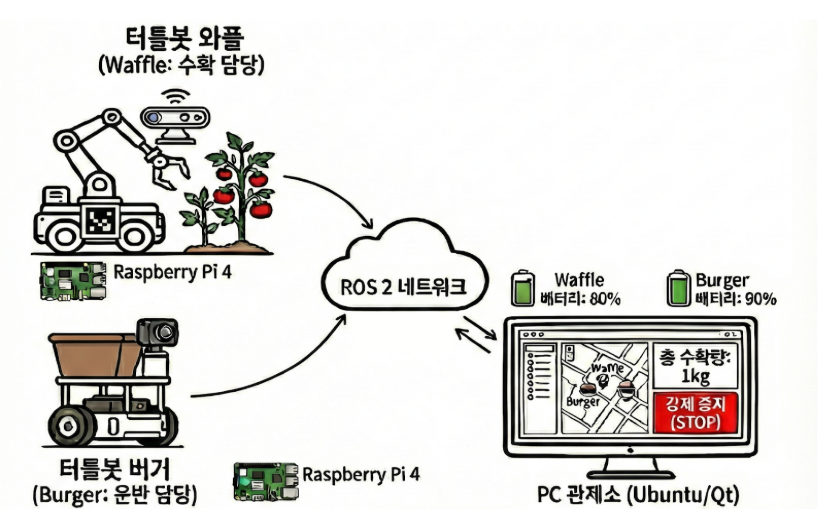
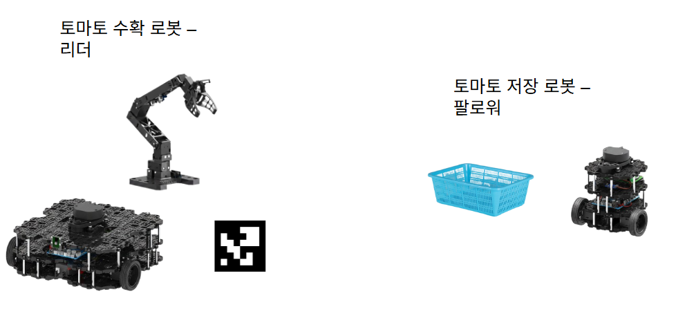
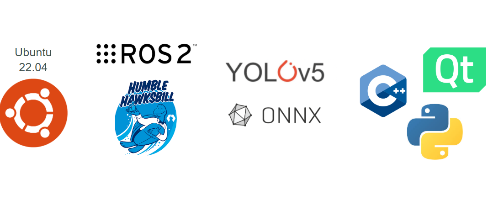
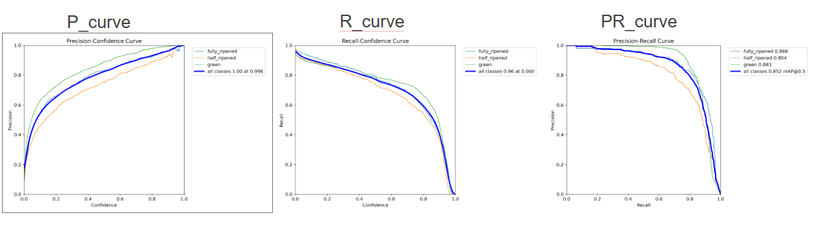
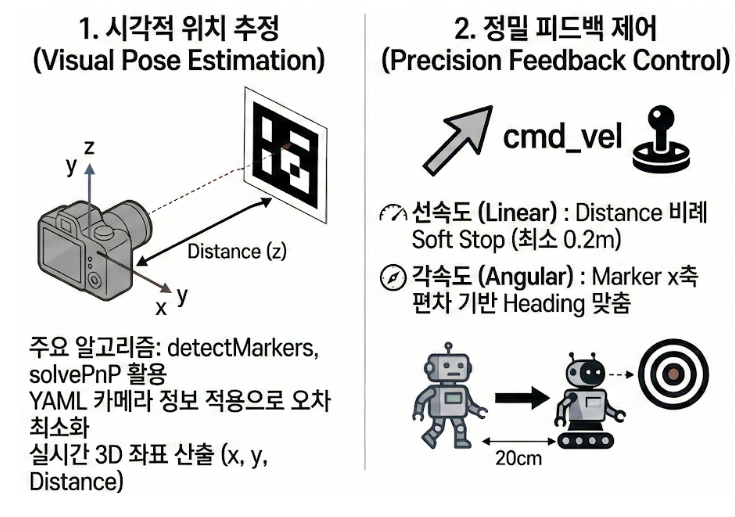
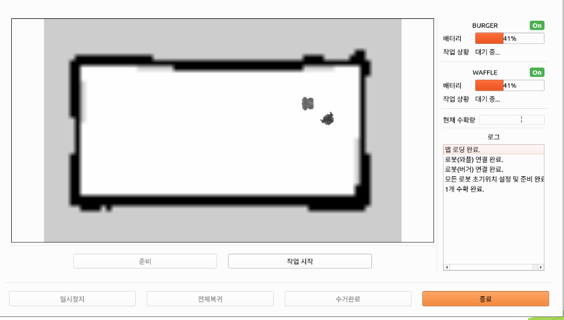
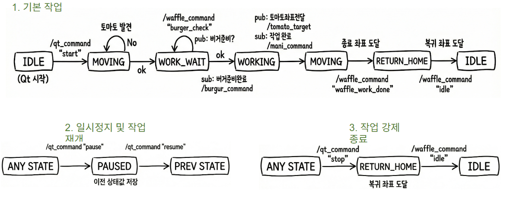
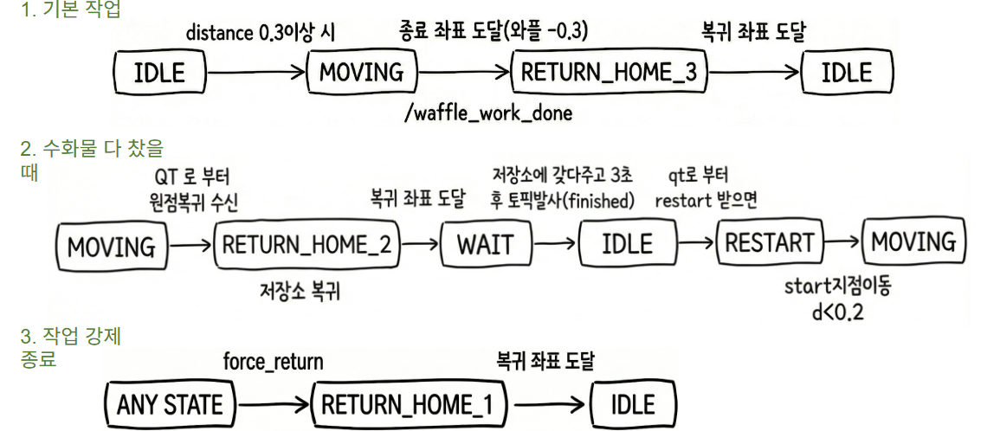
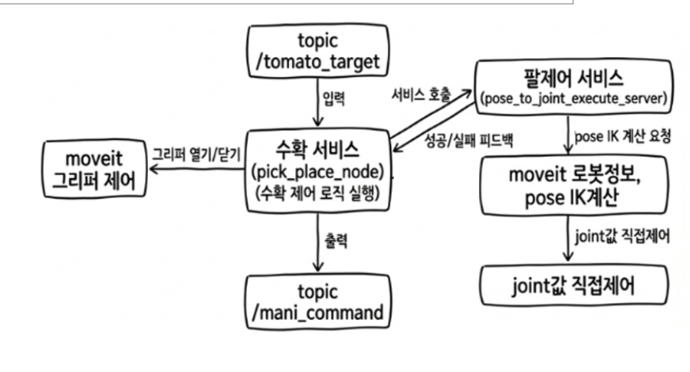

# 스마트팜
ROS 2 기반 다중 로봇 협업 토마토 수확 시스템 개발

##  개요
농촌 고령화/인력 부족 문제를 해결하기 위해, **수확(와플+매니퓰레이터) + 운반/저장(버거)** 을 **다중 로봇 협업**으로 자동화하는 ROS 2 기반 토마토 수확 시스템을 개발했습니다. 

---

##  목표 및 기대 효과
- **수확–운반 프로세스 무인화**를 통해 노동 시간 단축 및 작업 효율성 극대화 
- 육체적 부담 완화로 청년 농부 진입 장벽 해소 및 스마트 농업 실현
- 
---

##  시스템 구성(협업 시나리오)
- **리더(와플)**: 토마토 수확 수행  
- **팔로워(버거)**: ArUco 마커 추적을 통해 와플에 합류, 수확 토마토 저장/운반 수행  
- 시나리오 흐름:  
  1) 와플 선두 수확 → 2) 버거 마커 추적 & 저장 → 3) 바구니 가득 참  
  4) 와플 정지/대기 → 5) 버거 초기 위치 복귀 & 비움 → 6) 버거 재합류
  
- 하드웨어 구성
  
- 소프트웨어 구성
  
  
---

##  주요 기술 및 구현 요소
- **Tomato Detect(객체 인식)**: 토마토 감지 모델 및 성능(PR 커브 등) 기반 검증
  
- **ArUco Marker 기반 추적**: 팔로워 로봇이 리더 로봇을 안정적으로 추적/합류
  
- **시스템 통합 및 UI**: 다중 로봇 동작을 통합 제어/모니터링
  

---

##  동작 시나리오
1) Waffle (수확 로봇) 동작 시나리오
   
3) Burger (저장 및 운송 로봇) 동작 시나리오
   
5) OMX Manipulator (로봇팔) 동작 시나리오
   
   
---

##  (내 역할) 유진영
- **로봇 팔 제어 구현**
- **3D Pose 시스템 설계** 

---

##  트러블슈팅 / 해결
### 1) 토마토 감지 속도 문제(이동 중 탐지 누락)
- 원인: 객체 추론 함수가 약 **0.5초** 소요되어 프레임 단위 추적이 끊김 
- 해결: 입력 이미지 크기 **640 → 320 축소** 및 **추론 스레드 분리**로 추론 시간이 약 **0.12초**로 감소, 이동 중에도 안정적 판별 가능 

### 2) 다중 로봇 협업에서 통신 단절(ROS_DOMAIN_ID 제약)
- 이슈: ROS 2 환경에서 동일 ROS_DOMAIN_ID 기반 제어/통신 구조로 인해 통합 제어에 문제가 발생
- 해결: 와플은 Qt 노드에, 버거는 별도 **Bridge 노드**에 연결하고, Qt–Bridge 간 **프로세스 간 통신**으로 정보를 주고받는 구조로 변경

### 3) (Manipulator) 목표점 3D Pose 취득 → 제어 구조 개선
- 초기 아이디어: **스테레오(2대 카메라) + ORB 매칭 + 삼각측량**으로 3D pose 계산  
  - Z = d·f / B, X = (u−cx)·Z / fx, Y = (v−cy)·Z / fy
  - 시간 부족으로 다른 방법으로 구현
- 수정 목표: 팔 제어 **서비스**를 만들고 pose 기반 **IK(역기구학)**으로 joint 값을 계산해 직접 제어, 또한 **관절 구동 범위 제한**으로 안전 동작 확보 

---

##  시연
- 시연 영상: (https://youtu.be/Ap55N9suIGs?si=YEL8cA4sn5RbK5ra)
